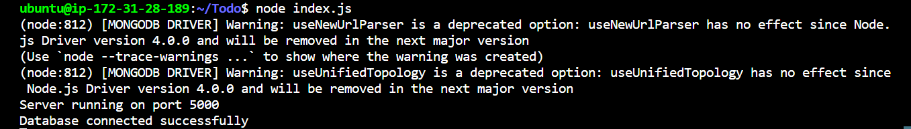
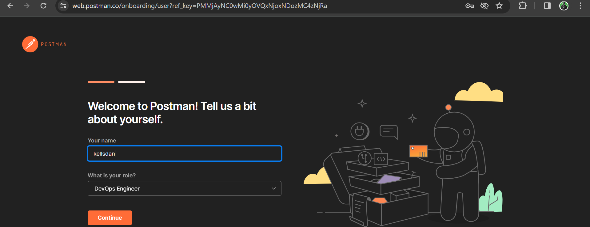
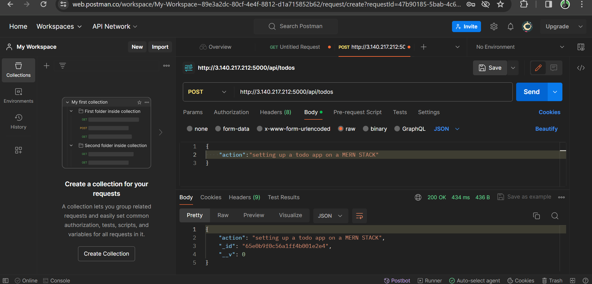
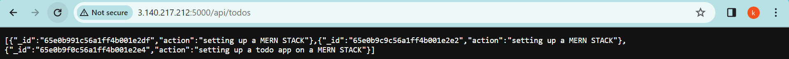
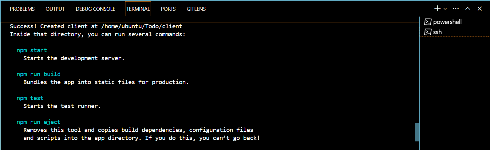
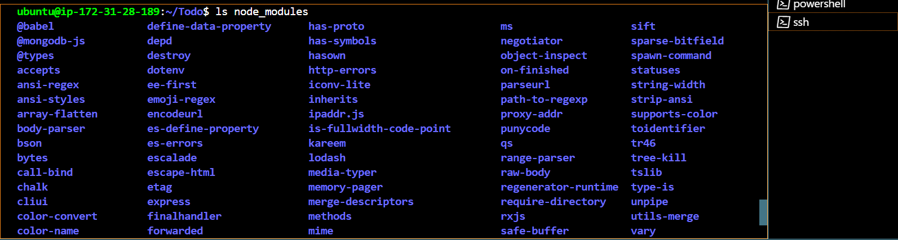

# MERN-STACK-APPLICATION
## A To-do web application implementation on a MERN Stack 
This web applciation is deployed on an EC2 Instance/Virtual Server running on the AWS Cloud


- The MERN stack is a popular JavaScript stack which is used for building modern day web applications. MERN is an acronym that stands for: MongoDB, Express.js, React, Node.js

**MongoDB:** MongoDB is a NoSQL database that stores data in flexible, JSON-like documents. MongoDB is highly scalable, flexible, and easy to use. This makes it a popular choice for web applications that require handling data in a more dynamic and flexible way.

**Express.js:** Express.js is a flexible Node.js web application framework that provides a set of features for building web and mobile applications. Express.js uses its robust set of features to simplify the process of building web servers and handling HTTP requests.

**React:** React is a JavaScript library for building user interfaces (UI). It allows developers to create reusable (UI) components that efficiently updates and render data as it changes. React's component-based architecture and virtual DOM make it well-suited for building dynamic and interactive user interfaces.

**Node.js:** Node.js is a JavaScript runtime built on Chrome's V8 JavaScript engine. It enables developers to run JavaScript code outside of a web browser, making it possible to build server-side applications using JavaScript. Node.js is highly efficient and scalable, making it a popular choice for building backend services in the MERN stack.
- ### Getting the location of Nodejs software from Ubuntu repositories 
curl is the command-line tool used to transfer data from or to a server. It is commonly used to download files or web pages from URLs.
This command downloads a script from NodeSource's website, which is responsible for setting up the Node.js 18.x repository on the system. The script is then executed with elevated privileges using sudo. This is a common way to install Node.js on Debian-based Linux distributions.
```
curl -fsSL https://deb.nodesource.com/setup_18.x | sudo -E bash -
```


- ### Install Node.js
```
sudo apt-get install -y nodejs
```
The command above installs both nodejs and npm. NPM is a package manager for Node like apt for Ubuntu, it is used to install Node modules & packages and to manage dependency conflicts. 

```
node -v
```

the node -v command is used to verify the node installation/version of node.js installed on your machine


___

- ### Application code setup: Create a new directory for your To-Do project
N/B: Directories are case sensitive Hence, "Todo" is not the same as "todo". 
```
mkdir Todo
```
N/B: After creating the Todo directory, run the ls command to verify that the Todo directory is created 
```
ls
```


change your current directory to the newly created Todo directory

```
cd Todo
```
- ### Initialize your Todo applicaiton project directory
```
npm init
```
Next, you will use the command npm init to initialise your project, so that a new file named package.json will be created. This file will normally contain information about your application and the dependencies that it needs to run. Follow the prompts after running the command. You can press Enter several times to accept default values, then accept to write out the package.json file by typing yes.

- **PS: The npm init command is used to initialize a new Node.js project by creating a package.json file. When you run npm init, npm (Node Package Manager) guides you through a series of prompts to gather information about your project, such as its name, version, description, entry point, test command, author, license, etc. Based on your responses, npm generates a package.json file with the provided metadata.**

- **Here's what happens when you run npm init:**

1. Prompts for Project Information: npm prompts you to provide information about your project. It asks questions such as the project name, version, description, entry point (main file), test command, repository URL, author name, license, etc.

2. User Input: You enter the requested information for each prompt. You can press Enter to accept the default value (shown in parentheses) or type your own value.

3. Package.json Generation: Once you've provided all the necessary information, npm generates a package.json file based on your responses. This file contains metadata about your project and is used by npm to manage dependencies, scripts, and other project-related settings.

4. The package.json file is crucial for Node.js projects as it serves as a manifest for the project, listing its dependencies, scripts for running tasks, and other metadata. It's used by npm to install dependencies, run scripts, and manage project settings. Creating a package.json file using npm init is typically the first step when starting a new Node.js project.
                    ***helpful tip yeah!!! 😊***


while still in the Todo directory, run the ls command to ensure that package.json file has been created in the Todo directory

```
ls
```
___

- ### INSTALL EXPRESS.JS
- Install ExpressJs and create the routes directory

 Express.js allows you to define routes for handling different HTTP requests (e.g., GET, POST, PUT, DELETE) and their corresponding responses.
 Express is a framework for Node.js, therefore a lot of things developers would have programmed is already taken care of out of the box. Therefore, it simplifies development, and abstracts a lot of low-level details. For example, Express helps to define routes of your application based on HTTP methods and URLs.
To use express, install it using npm:

```
npm install express
```
To verify if Express has been installed on your server, you can look for its presence in the package.json file of your Node.js project or globally on your server.
```
cat package.json
```


- ### Now create a file index.js with the command below

```
touch index.js
```
Install the dotenv module
```
npm install dotenv
```
**'dotenv'** is a Node.js module that loads environment variables from a .env file into the process.env object. It's commonly used in Node.js applications to manage configuration settings and sensitive information like API keys, database URIs, and other environment-specific variables. By using dotenv, you can keep sensitive information separate from your codebase and easily manage different configurations for development, testing, and production environments. It helps improve security and maintainability of your Node.js applications.

To verify if dotenv has been installed in your Node.js project directory, you can check the package.json file or look for the node_modules directory.

run the following command to vrify dotenv has been succefully installed.
```
cat package.json
```


Open the index.js file with the command below
```
vim index.js 
```

**PS**: you can use your prefered command line text editor viz: vim, Emacs, nano, neovim, sublime text, atom, etc. 

***🤗Vim and Nano are my most preffered command-line text editor 😊***

paste the code bellow in the vim text editor
```
const express = require('express');
require('dotenv').config();
 
const app = express();
 
const port = process.env.PORT || 5000;
 
app.use((req, res, next) => {
res.header("Access-Control-Allow-Origin", "\*");
res.header("Access-Control-Allow-Headers", "Origin, X-Requested-With, Content-Type, Accept");
next();
});
 
app.use((req, res, next) => {
res.send('Welcome to Express');
});
 
app.listen(port, () => {
console.log(`Server running on port ${port}`)
});
```
save and exit a file in vim using the command bellow

```
Press: esc
type: :wq
```
N/B: Notice that we have specified to use port 5000 in the code. This will be required later when we go on the browser.


Now we need to open this port in EC2 Security Groups


Inbound rule allowed on port 5000

Open up your preffered browser and try to access your server’s Public IP or Public DNS name followed by port :5000
```
http://<PublicIP-or-PublicDNS>:5000
```
```
http://18.117.240.107/:5000
```
***PS: Public IP addresses of ec2 instances are ephemeral- they change each time you stop and start an instance.***


- ### Routes
Our Todo applicaion will be tasked with perfoming three actions.
1. Create a new task
2. Display list of all tasks
3. Delete a completed task

Each task will be associated with some particular endpoint and will use different standard HTTP request methods: ***POST, GET, DELETE.***
For each task, we need to create routes that will define various endpoints that the To-do app will depend on. So let us create a routes folder.
```
mkdir routes
```
Enter the routes directory
```
cd routes
```
Now, create a file ***api.js*** with the command below
```
touch api.js
```
You can open the api.js file with your favourite command line text editor and post the code below. **I'll use vim 🥰**
```
const express = require ('express');
const router = express.Router();
 
router.get('/todos', (req, res, next) => {
 
});
 
router.post('/todos', (req, res, next) => {
 
});
 
router.delete('/todos/:id', (req, res, next) => {
 
})
 
module.exports = router;
```
Let's create the Models directory.

- ### MODELS ###
Now comes the interesting part, since the app is going to make use of Mongodb which is a NoSQL database, we need to create a model.
- A model is at the heart of JavaScript based applications, and it is what makes it interactive.
We will also use models to define the database schema . This is important so that we will be able to define the fields stored in each Mongodb document. 


In essence, the Schema is a blueprint of how the database will be constructed, including other data fields that may not be required to be stored in the database. These are known as virtual properties.

- To create a Schema and a model, install mongoose which is a Node.js package that makes working with mongodb easier.

Change directory back Todo folder with 👎and install mongoose
```
cd .. 
```
***N/B: .. takes you one directory behind***

```
npm install Mongoose
```
veify that mongoose has been installed using the command
```
npm list mongoose
```


Create a new directory; models
```
mkdir models
```
Change directory into the newly created ‘models’ folder with
```
cd models
```
Inside the models directory, create a file and name it todo.js
```
touch todo.js
```
**N/B: Tip:** All three commands above can be defined in one line to be executed consequently with help of && operator, like this ⤵️
```
mkdir models && cd models && touch todo.js
```
Open the file created with with your favourite command line code editor then paste the code below in the file: Again, i'll use ***vim command line code editor*** 😸

Now we need to update our routes from the file api.js in ‘routes’ directory to make use of the new model.
In Routes directory, open api.js with vim api.js, delete the code inside with 
```
:%d
```
command and paste the code below into it then save and exit
```
const express = require ('express');
const router = express.Router();
const Todo = require('../models/todo');
 
router.get('/todos', (req, res, next) => {
 
//this will return all the data, exposing only the id and action field to the client
Todo.find({}, 'action')
.then(data => res.json(data))
.catch(next)
});
 
router.post('/todos', (req, res, next) => {
if(req.body.action){
Todo.create(req.body)
.then(data => res.json(data))
.catch(next)
}else {
res.json({
error: "The input field is empty"
})
}
});
 
router.delete('/todos/:id', (req, res, next) => {
Todo.findOneAndDelete({"_id": req.params.id})
.then(data => res.json(data))
.catch(next)
})
 
module.exports = router;
```
We now head onto mongoDB configuration as the next piece of our Todo application.

- **MONGODB DATABASE CONFIG**

We need a database where we will store our data. For this we will make use of mLab. mLab provides MongoDB database as a service solution (DBaaS), so to make life easy, you will need to sign up for a shared clusters free account, which is ideal for our use case. Sign up here. Follow the sign up process, select AWS as the cloud provider, and choose a region near you.

- ### DBaaS
**DBaaS stands for "Database as a Service"**. It refers to a cloud computing service model where database management tasks are outsourced to a third-party provider, who hosts and maintains the database infrastructure, while the users access and use the database through the Internet.

In a DBaaS model, users typically do not need to worry about managing the underlying hardware, software installation, configuration, scaling, backups, and security of the database. Instead, these tasks are handled by the service provider, allowing users to focus on developing applications and using the database without the burden of managing the infrastructure.

***PS: In order to protect my mongodb account, I decided to add a MFA using google authenticator-app***


In the **index.js** file, we specified process.**env** to access environment variables, but we have not yet created this file. So we need to do that now.
Create a file in your Todo directory and name it .env.
```
touch .env
```
copy the connection string to the .env file to access the database in it.


```
vim .env
```
```
DB= mongodb+srv://<username>:<password>@cluster0.icssbqo.mongodb.net/?retryWrites=true&w=majority&appName=Cluster0
```
***N/B: In the connection string above, edit and input your username and password***

Now we need to update the **index.js** to reflect the use of **.env** so that Node.js can connect to the database.
Simply delete existing content in the file, and update it with the entire code below.
```
const express = require('express');
const bodyParser = require('body-parser');
const mongoose = require('mongoose');
const routes = require('./routes/api');
const path = require('path');
require('dotenv').config();
 
const app = express();
 
const port = process.env.PORT || 5000;
 
//connect to the database
mongoose.connect(process.env.DB, { useNewUrlParser: true, useUnifiedTopology: true })
.then(() => console.log(`Database connected successfully`))
.catch(err => console.log(err));
 
//since mongoose promise is depreciated, we overide it with node's promise
mongoose.Promise = global.Promise;
 
app.use((req, res, next) => {
res.header("Access-Control-Allow-Origin", "\*");
res.header("Access-Control-Allow-Headers", "Origin, X-Requested-With, Content-Type, Accept");
next();
});
 
app.use(bodyParser.json());
 
app.use('/api', routes);
 
app.use((err, req, res, next) => {
console.log(err);
next();
});
 
app.listen(port, () => {
console.log(`Server running on port ${port}`)
});
```
To do that using vim, follow below steps
Open the file with 
```
vim index.js
Press esc
Type :
Type %d
Hit ‘Enter’
The entire content will be deleted, then,
Press i to enter the insert mode in vim
paste the code above
press esc
press :wq to save and exit vim editor mode
```
Using environment variables to store information is considered more secure and best practice to separate configuration and secret data from the application, instead of writing connection strings directly inside the index.js application file.
Start your server using the command:

```
node index.js
```
You shall see a message **‘Database connected successfully’**, if so – we have our backend configured. 



- ***woah!!! 😸 🥰 Congratulations 🥇 👍***


### Now we are going to test it.
Testing Backend Code without Frontend using RESTful API.


Untill now, we have written backend part of our To-Do application, and configured a database, but we do not have a frontend UI yet. We need ReactJS code to achieve that. But during development, we will need a way to test our code using ***RESTfulL API***. Therefore, we will need to make use of some API development client to test our code.
In this project, we will use **Postman** to test our API.
Click Install Postman to download and install postman on your machine. you can aswell use the web version of postman 

You should test all the API endpoints and make sure they are working. For the endpoints that require body, you should send JSON back with the necessary fields since it’s what we setup in our code.
Now open your Postman, create a POST request to the API 
```
http://<PublicIP-or-PublicDNS>:5000/api/todos
http://3.140.217.212:5000/api/todos
```


Postman responds to get request over the web using Insatance Public IP


. This request sends a new task to our To-Do list so the application could store it in the database.

***Note: make sure you set header key Content-Type as application/json***

- **CREATING THE FRONTEND OF OUR TODO APPLICATION**

After implementing the backend and API functionality of our todo app, it is time to create a user interface for a Web client (browser) to interact with the application via API. To start out with the frontend of the To-do app, we will use the ***create-react-app*** command to scaffold our app.

In the same root directory as your backend code, which is the Todo directory, run:
```
 npx create-react-app client
```


This command will create a new folder in your Todo directory called client, where you will add all the react code running a React App.
Before testing the react app, there are some dependencies that need to be installed.

**Install concurrently**. It is used to run more than one command simultaneously from the same terminal window.

```
npm install concurrently --save-dev
```
run
```
ls node_modules
```
to ensure concurrently is installed 


**Install nodemon**. It is used to run and monitor the server. If there is any change in the server code, nodemon will restart it automatically and load the new changes.
```
npm install nodemon --save-dev
```
In Todo folder open the **package.json** file. Change the highlighted part of the below screenshot and replace with the code below.
```
"scripts": {
"start": "node index.js",
"start-watch": "nodemon index.js",
"dev": "concurrently \"npm run start-watch\" \"cd client && npm start\""
},
```
Now we Configure Proxy in package.json
Change directory to ‘client’
```
cd client
```
Open the package.json file
```
vim package.json
```
Add the key value pair in the package.json file "proxy": "http://localhost:5000".
The whole purpose of adding the proxy configuration in number 3 above is to make it possible to access the application directly from the browser by simply calling the server url like http://localhost:5000 rather than always including the entire path like http://localhost:5000/api/todos
Now, ensure you are inside the Todo directory, and simply do:

Start the Development Server
```
npm run dev
```
***N/B: Do not forget to allow an inbound security group rule on port 3000***

- **For our Todo app, there will be two stateful components and one stateless component.**

Go to client directory from your Todo directory

```
cd client
```
move to the src directory
```
cd src
```
Inside your src folder create another folder called components
```
mkdir components
```
Move into the components directory with
```
cd components
```
Inside ‘components’ directory create three files Input.js, ListTodo.js and Todo.js.
```
touch Input.js ListTodo.js Todo.js
```
Open Input.js file with your favourite code commandline editor
```
vim Input.js
```
Copy and paste the following code
```
import React, { Component } from 'react';
import axios from 'axios';
 
class Input extends Component {
 
state = {
action: ""
}
 
addTodo = () => {
const task = {action: this.state.action}
 
    if(task.action && task.action.length > 0){
      axios.post('/api/todos', task)
        .then(res => {
          if(res.data){
            this.props.getTodos();
            this.setState({action: ""})
          }
        })
        .catch(err => console.log(err))
    }else {
      console.log('input field required')
    }
 
}
 
handleChange = (e) => {
this.setState({
action: e.target.value
})
}
 
render() {
let { action } = this.state;
return (
<div>
<input type="text" onChange={this.handleChange} value={action} />
<button onClick={this.addTodo}>add todo</button>
</div>
)
}
}
 
export default Input
```
- ### Axios
***Axios is a popular JavaScript library used for making HTTP requests from browsers or Node.js environments. It allows you to make asynchronous HTTP requests to REST endpoints and perform CRUD operations (Create, Read, Update, Delete) on data.***

***Axios provides a simple and intuitive API for making HTTP requests and supports features like Promise-based responses, interceptors for request and response handling, and the ability to cancel requests.***

***It's commonly used in frontend applications built with frameworks like React, Vue.js, or Angular, as well as in Node.js backend applications, due to its flexibility, ease of use, and widespread community support.***

cd into you client directory
```
cd client
```
Install axios
```
npm install axios
```
Go to components directory
```
cd src/components
```
After that open your ListTodo.js
```
vim ListTodo.js
```
in the ListTodo.js copy and paste the following code
```
import React from 'react';
 
const ListTodo = ({ todos, deleteTodo }) => {
 
return (
<ul>
{
todos &&
todos.length > 0 ?
(
todos.map(todo => {
return (
<li key={todo._id} onClick={() => deleteTodo(todo._id)}>{todo.action}</li>
)
})
)
:
(
<li>No todo(s) left</li>
)
}
</ul>
)
}
 
export default ListTodo
```
Then in your Todo.js file you write the following code
```
import React, {Component} from 'react';
import axios from 'axios';
 
import Input from './Input';
import ListTodo from './ListTodo';
 
class Todo extends Component {
 
state = {
todos: []
}
 
componentDidMount(){
this.getTodos();
}
 
getTodos = () => {
axios.get('/api/todos')
.then(res => {
if(res.data){
this.setState({
todos: res.data
})
}
})
.catch(err => console.log(err))
}
 
deleteTodo = (id) => {
 
    axios.delete(`/api/todos/${id}`)
      .then(res => {
        if(res.data){
          this.getTodos()
        }
      })
      .catch(err => console.log(err))
 
}
 
render() {
let { todos } = this.state;
 
    return(
      <div>
        <h1>My Todo(s)</h1>
        <Input getTodos={this.getTodos}/>
        <ListTodo todos={todos} deleteTodo={this.deleteTodo}/>
      </div>
    )
 
}
}
 
export default Todo;
```
We need to make little adjustment to our react code. Delete the logo and adjust our App.js to look like this.
Move to the src folder
```
cd src
```
Make sure that you are in the src folder and run
```
vim App.js
```
Copy and paste the code below into it
```
import React from 'react';
 
import Todo from './components/Todo';
import './App.css';
 
const App = () => {
return (
<div className="App">
<Todo />
</div>
);
}
 
export default App;
```
After pasting, exit the editor.
In the src directory open the App.css
```
vim App.css
```
Then paste the following code into App.css
```
.App {
text-align: center;
font-size: calc(10px + 2vmin);
width: 60%;
margin-left: auto;
margin-right: auto;
}
 
input {
height: 40px;
width: 50%;
border: none;
border-bottom: 2px #101113 solid;
background: none;
font-size: 1.5rem;
color: #787a80;
}
 
input:focus {
outline: none;
}
 
button {
width: 25%;
height: 45px;
border: none;
margin-left: 10px;
font-size: 25px;
background: #101113;
border-radius: 5px;
color: #787a80;
cursor: pointer;
}
 
button:focus {
outline: none;
}
 
ul {
list-style: none;
text-align: left;
padding: 15px;
background: #171a1f;
border-radius: 5px;
}
 
li {
padding: 15px;
font-size: 1.5rem;
margin-bottom: 15px;
background: #282c34;
border-radius: 5px;
overflow-wrap: break-word;
cursor: pointer;
}
 
@media only screen and (min-width: 300px) {
.App {
width: 80%;
}
 
input {
width: 100%
}
 
button {
width: 100%;
margin-top: 15px;
margin-left: 0;
}
}
 
@media only screen and (min-width: 640px) {
.App {
width: 60%;
}
 
input {
width: 50%;
}
 
button {
width: 30%;
margin-left: 10px;
margin-top: 0;
}
}
```
In the src directory open the index.css
```
vim index.css
```
Copy and paste the code below:
```
body {
margin: 0;
padding: 0;
font-family: -apple-system, BlinkMacSystemFont, "Segoe UI", "Roboto", "Oxygen",
"Ubuntu", "Cantarell", "Fira Sans", "Droid Sans", "Helvetica Neue",
sans-serif;
-webkit-font-smoothing: antialiased;
-moz-osx-font-smoothing: grayscale;
box-sizing: border-box;
background-color: #282c34;
color: #787a80;
}
 
code {
font-family: source-code-pro, Menlo, Monaco, Consolas, "Courier New",
monospace;
}
```
Go to the Todo directory
```
cd ../..
```
When you are in the Todo directory run:
```
npm run dev
```
***If evrything was done properly, our Todo app should be up and running with all its CRUD functionalities***

***CONGRATULATIONS YOU HAVE SUCCESFULLY IMPLENMENTED A TODO APP ON A MERN STACK👍🥇***
